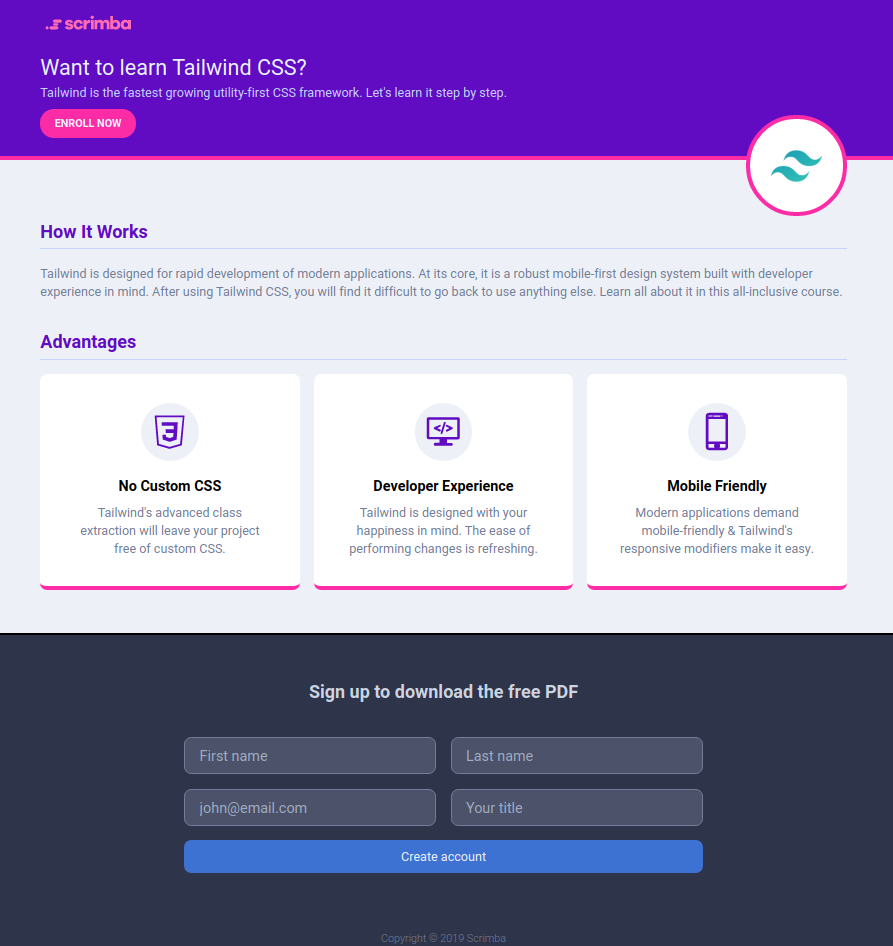
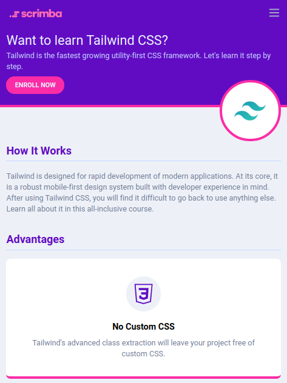

# Getting started with Tailwind CSS framework

## Tutorial

Tutorial can be found in [Scrimba - Tailwind CSS](https://scrimba.com/p/pdq3QsM/cPJZqqC3) for free.

## Artifact

The resulting responsive web page looks like this :

_wide screen rendering_


_small screen rendering_


## Demonstration

The page has been published in surge site.
You cann freely access it and test the page.

## Install

You can install and test the page locally.

First, clone this git repository :

```bash
git clone https://github.com/tiamat-azure/tailwindcss-trial.git
```

Then, open index.html file in your favorite web browser.

## Bibliography

[Scrimba Tutorial Plateform](https://scrimba.com)

[Tailwind CSS Tutorial](https://scrimba.com/p/pdq3QsM/cPJZqqC3)

[Tailwind CSS Official Site](https://tailwindcss.com/)
